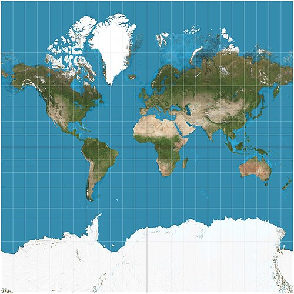
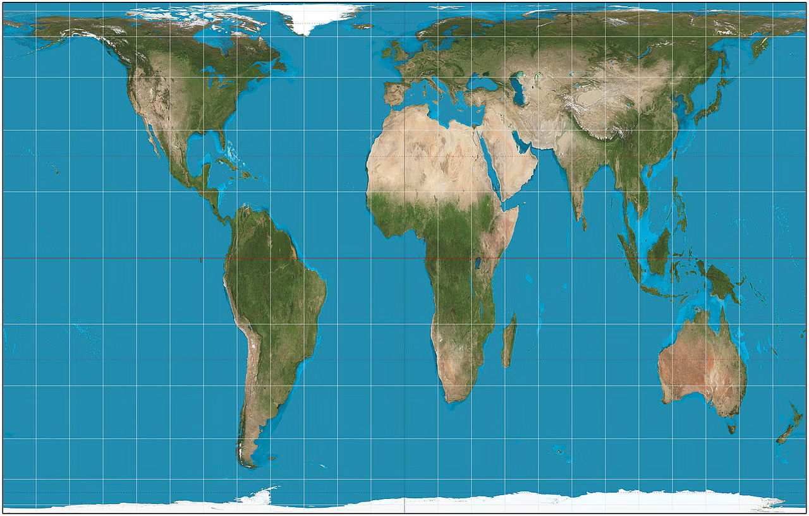

# ISS Tracker on a Gall-Peters Projection

A real-time tracking application that maps the exact coordinates of the International Space Station (ISS) using an equal-area Gall-Peters map projection.

---

## 1. The International Space Station (ISS)

### About the ISS
The International Space Station (ISS) is a large, habitable artificial satellite in low Earth orbit. It serves as a microgravity and space environment research laboratory where crew members conduct experiments in biology, human biology, physics, astronomy, meteorology, and other fields. It has been continuously occupied since November 2000 and represents a collaborative effort between five participating space agencies: NASA (United States), Roscosmos (Russia), JAXA (Japan), ESA (Europe), and CSA (Canada).

### Speed and Orbit
* **Speed:** The ISS travels at an incredible speed of approximately **27,600 km/h (17,100 mph)**. 
* **Altitude:** It orbits at an average altitude of roughly 400 kilometers (250 miles) above the Earth.
* **Orbits per day:** Because of its immense speed, the station circles the Earth roughly every 93 minutes, completing about **15.5 orbits every day**.

### What It Does
The ISS is a unique scientific testbed. Due to the weightless environment (microgravity), researchers can study physical and biological processes in ways that are impossible on Earth. It is also used to test spacecraft systems and equipment required for future long-duration deep space missions, such as journeys to the Moon and Mars.

### Who Lives There?
The station typically accommodates an international crew of **7 astronauts and cosmonauts**, though this number can fluctuate (sometimes reaching 10 to 13 people) during crew handovers and short-term visits. The residents spend their days maintaining the station, exercising to prevent muscle and bone loss in microgravity, and executing cutting-edge scientific experiments.

---

## 2. Map Projection: Mercator vs. Gall-Peters

This project intentionally utilizes the Gall-Peters projection to visualize the ISS's orbital track. Understanding why requires looking at how we project our spherical Earth onto a flat surface.

### The Mercator Projection and Its Shortcomings



Developed by Gerardus Mercator in 1569, the Mercator projection became the standard for marine navigation because it preserves angles and directions perfectly, allowing sailors to plot straight-line courses. 

However, it has a massive drawback: **extreme areal distortion**. 
* As you move farther from the equator toward the poles, the map stretches dramatically. 
* Greenland appears to be roughly the same size as Africa, when in reality, Africa is **14 times larger** than Greenland. 
* This distortion creates a Eurocentric/Western-centric bias, inadvertently shrinking developing nations near the equator and ballooning northern landmasses.
* Tracking the ISS on a Mercator map would visually distort the actual surface area the station is traversing.

### How the Gall-Peters Map Solved This



The **Gall-Peters projection** is an *equal-area* cylindrical map projection. First described by James Gall in 1855 and popularized by Arno Peters in 1973, it addresses the shortcomings of the Mercator map by prioritizing correct relative sizes:
* **True Proportion:** All landmasses are shown in correct proportion to one another. Africa, South America, and India are displayed with their accurate geographic weight relative to North America and Europe.
* **Tracking Benefits:** By mapping the ISS on a Gall-Peters projection, the visual path of the station accurately reflects the actual proportions of the Earth’s surface area it passes over, offering a fairer and geographically truer representation of the station's trajectory.

---

## 3. API Documentation

This application polls the Open Notify public API to fetch real-time geographic coordinates for the International Space Station.

### Endpoint
* **URL:** `http://api.open-notify.org/iss-now.json`
* **HTTP Method:** `GET`
* **Authentication:** None (Public API)

### Request Details
This API takes no query parameters or body inputs. 

```bash
# Example Request using cURL
curl [http://api.open-notify.org/iss-now.json](http://api.open-notify.org/iss-now.json)